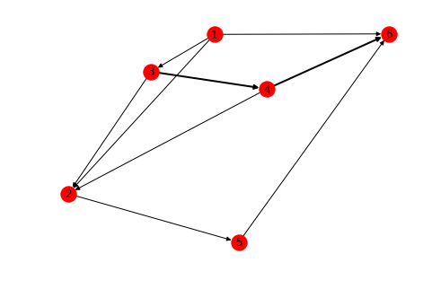
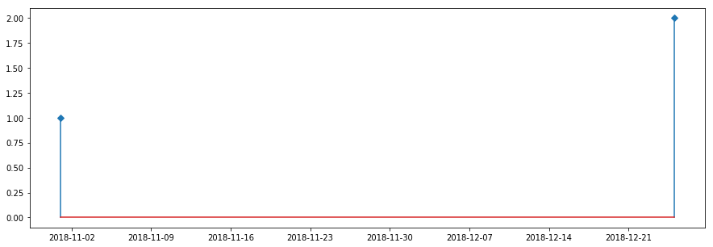

# python作图

### 画一个graph

```python
import networkx as nx
import pandas as pd

data = pd.Series([(1,2),(3,4),(5,6),(1,3),(4,6),(3,4),(4,2),(1,6),(4,6),(2,5),(3,2)])
vc = data.value_counts()
graph1 = nx.DiGraph()

graph1.add_weighted_edges_from([(i[0],i[1],vc[i]) for i in vc.index])
edges,weights = zip(*nx.get_edge_attributes(graph1,'weight').items())
pos=nx.spring_layout(graph1)
nx.draw(graph1,width=weights,with_labels=True,pos=pos)

```




### 在时间轴上显示事件频率

```python
import matplotlib.dates as mdate
import matplotlib.pyplot as plt
from datetime import datetime
import pandas as pd
date_vc = pd.Series([datetime(2018,11,1).date(),datetime(2018,12,25).date(),datetime(2018,12,25).date()]).value_counts()

fig1 = plt.figure(figsize=(15,5))
ax1 = fig1.add_subplot(1,1,1)
ax1.xaxis.set_major_formatter(mdate.DateFormatter('%Y-%m-%d')) #设置时间标签显示格式
# plt.xticks(pd.date_range('2018-08-01','2018-10-30'),rotation=90)

plt.stem(date_vc.index,date_vc.values, markerfmt='D')

```



