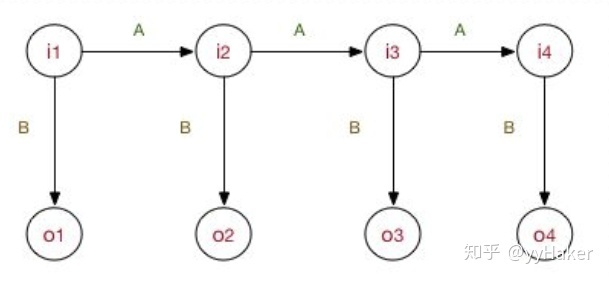
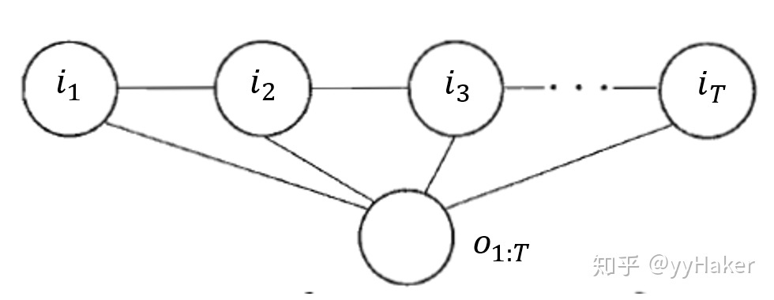

# 04.12-04.18 回顾

#HMM、MEMM、CRF对比

### HMM

- 假设：**一阶马尔可夫假设**和**观测独立性假设**

- 公式表示（注意是**联合**概率，**生成式**模型）：
  $$
  P(I,O)=P(i_1)P(o_1|i_1)\prod_{t=2}^TP(i_t|i_{t-1})P(o_t|i_t)
  $$

- 示意图

  

### MEMM

- 假设：一阶马尔可夫假设（抛弃了观测独立假设）

- 公式表示（注意是**条件**概率，**判别式**模型）：
  $$
  P(I|O)=\prod_{t=1}^T P(i_t|i_{t-1},o_{1:T})=\prod_{t=1}^T \frac{\exp(\sum_{k=1}^M \lambda_kf_k(i_{t-1},i_t,o_{1:T}))}{Z(i_{t-1},o_{1:T})}
  $$
  注意：$Z(i_{t-1},o_{1:T})$ 是个**局部归一化**，容易造成**标注偏置问题**。

- 示意图

  

### CRF

- 条件随机场的假设

  设 $X$ 和 $Y$ 是随机变量，$P(Y|X)$ 是给定X的条件下Y的条件概率分布。若 $Y$ 构成的无向图 $G=(V,E)$ 表示的马尔可夫随机场，即
  $$
  P(Y_v|X,Y_w,w\ne v)=P(Y_v|X,Y_w,w\sim  v)
  $$
  对任意结点成立，则称条件概率分布$P(Y|X)$ 为条件随机场。$w\sim  v$ 表示所有和 $v$ 有连接的结点，$w\ne v$ 表示除 $v$ 以外的所有结点。

- 公式表示
  $$
  \begin{align}
  P(I|O)&=\frac1{Z(O)}\prod_c \Psi_c(I_c|O)\\
  &=\frac1{Z(O)}\exp\left(\sum_{t=1}^{T-1}\sum_{j=1}^J\lambda_j t_j(i_t,i_{t+1},O,t)+\sum_{t=1}^T\sum_{k=1}^K \mu_k s_k(i_t,O,t)\right)
  \end{align}
  $$
  其中 $\Psi_c$ 表示与团 $c$ 对应的势函数，$Z(O)$ 是**全局归一化**，克服了MEMM的标注偏置问题。

  CRF彻底抛弃了HMM的两条不合理假设，采用**团**和**势函数**进行建模。

- 示意图

  

参考资料：[知乎-从HMM、MEMM到CRF](https://zhuanlan.zhihu.com/p/71190655) 

# 最大熵模型和CRF

### 最大熵模型

- 定义：**最大化条件熵**

  假设所有满足约束条件的模型集合为
  $$
  \mathcal C=\{P\in\mathcal P\ \ |\ \ E_{P}(f_i)=E_{\tilde P}(f_i) \}
  $$
  其中，$i=1,2,\cdots,n$ ，$n$ 是特征函数的个数，也是约束条件的个数。定义在条件概率分布 $P(Y|X)$ 上的条件熵：
  $$
  H(P)=-\sum_{x,y}\tilde P(x)P(y|x)\log P(y|x)
  $$
  则模型集合 $\mathcal C$ 中使得 $H(P)$ 最大的模型称为最大熵模型。其中对数的底数是 $e$ 。

- 经过拉格朗日对偶后，转化为问题：
  $$
  P(y|x)=\frac1{Z(x)}\exp\left[\sum_{i=1 }^nw_if_i(x,y)\right] \\
  Z(x)=\sum_y\exp\left[\sum_{i=1 }^nw_if_i(x,y)\right]
  $$
  其中，$P(y|x)$ 是最优的条件概率。对应的**拉格朗日函数**（同时也是**对数似然函数**）
  $$
  \begin{align}
  L(P,w)&=\log\prod_{x,y}P(y|x)^{\tilde P(x,y)}=\sum_{x,y}\tilde P(x,y)\log P(y|x)\\
  &=\sum_{x,y}\tilde P(x,y)\sum_{i=1}^n w_if_i(x,y)-\sum_x\tilde P(x)\log Z(x)
  \end{align}
  $$

- 采用IIS，拟牛顿法等方法求解。

### CRF

- 定义：**最大化一个无向图的概率**（采用团和势函数建模）
  $$
  \begin{align}
  P(I|O)&=\frac1{Z(O)}\prod_c \Psi_c(I_c|O)\\
  &=\frac1{Z(O)}\exp\left(\sum_{t=1}^{T-1}\sum_{j=1}^J\lambda_j t_j(i_t,i_{t+1},O,t)+\sum_{t=1}^T\sum_{k=1}^K \mu_k s_k(i_t,O,t)\right)
  \end{align}
  $$

- 对上述公式进行改写，将 $t_j$ 和 $s_k$ 统一写为 $f_k$ 的形式
  $$
  f_k(i_t,i_{t+1},O,t)=\cases{t_j(i_t,i_{t+1},O,t),\ \ \ \ \  k=1,2,\cdots,K_1 \\ s_l(i_t,O,t),\ \ \ \ \ \ \ \ \ \ \ \ \ k=K_1+l;l=1,2,\cdots,K_1}
  $$
  再令
  $$
  f_k(x,y)=\sum_{t=1}^Tf_k(i_t,i_{t+1},O,t)
  $$
  权值也统一写成 $w_k$ 。则 $P(I|O)$ 可以写成
  $$
  P(I|O)=\frac1{Z(x)}\exp\left[\sum_{k=1 }^nw_kf_k(x,y)\right]
  $$
  可以看到和最大熵模型有一样的形式。它们都属于log linear model。

### Log linear model的求解

- Log linear model 都可以用梯度下降法，IIS，牛顿法，拟牛顿法进行求解。下面给出的是拟牛顿法的BFGS算法。对于条件概率
  $$
  P_w(y|x)=\frac1{Z(x)}\exp\left[\sum_{i=1 }^nw_if_i(x,y)\right] 
  $$
  学习的优化目标函数为：
  $$
  \min_{w\in\R^n}f(w)=\sum_x\tilde P(x)\log\sum_y\exp\left[\sum_{i=1}^n w_if_i(x,y)\right]-\sum_{x,y}\tilde P(x,y)\sum_{i=1}^n w_if_i(x,y)
  $$
  注意，此处转化为了**最小化**，因此加了负号。同时，利用了如下性质：
  $$
  \sum_{x,y}\tilde P(x,y)=\sum_x\tilde P(x)
  $$
  目标函数的梯度函数为
  $$
  g(w)=\sum_{x,y}\tilde P(x)P_w(y|x)f(x,y)-E_{\tilde P}(f)
  $$

- 最大熵模型、MEMM、CRF都可以利用上面的公式，进行标准的BFGS算法进行求解。具体的BFGS算法过程略（参见之前的笔记）。

  

### 疑问

- 在pytorch的tutorial中，CRF的对数似然函数为：
  $$
  \log P(Y|X)
  $$
  而统计学习方法中为:
  $$
  \log\prod_{x,y}P(y|x)^{\tilde P(x,y)}=\sum_{x,y}\tilde P(x,y)\log P(y|x)
  $$
  怎么理解？

- biLSTM+CRF和IDCNN+CRF哪种实际中效果更好？

  https://www.jiqizhixin.com/articles/2018-08-31-2 中显示IDCNN速度更快。

# 刷题

本周之前题数：45

本周之后题数：

- #### [寻找峰值](https://leetcode-cn.com/problems/find-peak-element/)

  ```python
  class Solution:
      def findPeakElement(self, nums: List[int]) -> int:
          l = 0
          r = len(nums) -1
          while l < r:
              mid = l + (r-l)//2
              if nums[mid] < nums[mid+1]:
                  l = mid + 1
              else:
                  r = mid 
          return l
  ```

  - 注意，当条件是`l<r; mid = (l+r)//2` 时，有`mid+1<=r`成立。因此可以放心使用`mid+1` 作为索引。
  - 以及二分的退出条件。（仔细体会一下）

- #### [数组中的第K个最大元素](https://leetcode-cn.com/problems/kth-largest-element-in-an-array/)

  ```python
  class Solution:
      def findKthLargest(self, nums: List[int], k: int) -> int:
          idx = len(nums) - k 
          self.helper(nums,0,len(nums)-1,idx)
          return nums[idx]
  
      def helper(self,nums,l,r,idx):
          m = self.partition(nums,l,r)
          if m == idx:
              return
          elif m < idx:
              self.helper(nums,m+1,r,idx)
          else:
              self.helper(nums,l,m-1,idx)
  
      def partition(self,nums,l,r):
          mid = (l + r)//2
          nums[l] ,nums[mid] = nums[mid], nums[l]#此处是（伪）随机选择pivot，可以大幅减少运行时间
          p = l
          while l<r:
              while l<r and nums[r] >= nums[p]:
                  r -= 1
              while l<r and nums[l] <= nums[p]:
                  l += 1
              nums[l], nums[r] = nums[r], nums[l]
          nums[l], nums[p] = nums[p], nums[l]
          return l # 注意返回值是l，不是p
  ```

  加入（伪）随机选择pivot前后的运行时间对比。（还可以用堆来解 ，以后再说）

  

- #### [ Pow(x, n)](https://leetcode-cn.com/problems/powx-n/)

  ```python
  class Solution:
      def myPow(self, x: float, n: int) -> float:
          if n == 0:
              return 1
          if n < 0:
              return 1 / self.myPow(x , -n)
          elif n > 0:
              if n%2:
                  return self.myPow(x*x,n//2) * x
              else:
                  return self.myPow(x*x,n//2)
  ```

- #### [有序数组中的单一元素](https://leetcode-cn.com/problems/single-element-in-a-sorted-array/)

  ```python
  class Solution:
      def singleNonDuplicate(self, nums: List[int]) -> int:
          l = 0
          r = len(nums)-1
          while l<r:
              mid = l + (r-l) // 2
              if mid%2 :
                  mid -= 1
              if nums[mid] == nums[mid+1]:
                  l = mid + 2
              else:
                  r = mid
          return nums[l]
  ```

  注意将mid为奇数的情况转换为偶数，可以提高效率。

- #### [最大子序和](https://leetcode-cn.com/problems/maximum-subarray/)

  ```python
  class Solution:
      def maxSubArray(self, nums: List[int]) -> int:
          if len(nums)==1:
              return nums[0]
  
          mid = len(nums)//2  # 注意不是 mid = l + (r-l)//2，仔细想为什么
          left_max = self.maxSubArray(nums[:mid])
          right_max = self.maxSubArray(nums[mid:])
  
          mid_left = nums[mid-1]
          tmp = 0
          for i in range(mid-1,-1,-1):
              tmp += nums[i]
              mid_left = max(tmp,mid_left)
          
          mid_right = nums[mid]
          tmp = 0
          for i in range(mid,len(nums)):
              tmp += nums[i]
              mid_right = max(tmp, mid_right)
  
          return max(left_max,right_max,mid_left+mid_right)
  ```

  回头再补动态规划。

- #### [数组中的逆序对](https://leetcode-cn.com/problems/shu-zu-zhong-de-ni-xu-dui-lcof/)

  ```python
  class Solution:
      def reversePairs(self, nums: List[int]) -> int:
          self.count = 0
          def merge(nums1,nums2):
              l1 = len(nums1)
              l2 = len(nums2)
              temp = []
              i = 0
              j = 0
              while i<l1 and j<l2:
                  if nums1[i] <= nums2[j]:
                      temp.append(nums1[i])
                      i += 1
                  else:
                      temp.append(nums2[j])
                      j += 1
                      self.count += l1 - i
              if i < l1:
                  temp += nums1[i:]
              if j < l2:
                  temp += nums2[j:]
              return temp
          def merge_sort(nums):
              if len(nums) <= 1:
                  return nums
              mid = (len(nums)-1)//2 
              # 此处相当于mid = l + (r-l)//2，下面注意是mid+1，而不是mid，细节
              # 如果是 mid = len(nums)//2 ，则下面是mid，和上一题做对比
              res = merge(merge_sort(nums[:mid+1]),merge_sort(nums[mid+1:]))
              return res
          merge_sort(nums)
          return self.count
  ```

  


## Plan of next week

- 


