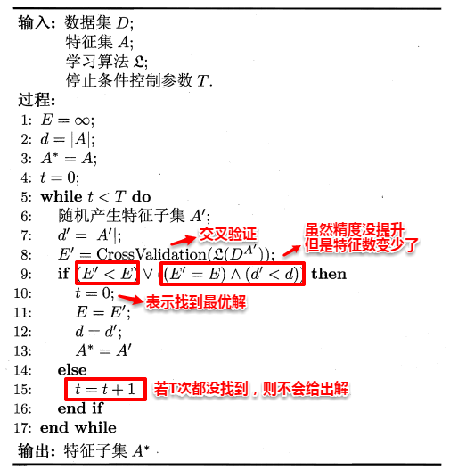

# 05.17-05.23 回顾

# 1. 特征工程

- 数据和特征决定了机器学习算法的上限。更多的数据胜于更好的算法，更好的数据胜于更多的数据。
- 特征工程就是将原始数据空间，变换到新的特征空间。
- 特征工程和模型二者此消彼长，复杂的模型一定程度上减少了特征工程需要做的工作。
- 特征工程的第一步时理解业务数据和业务逻辑。特征提取可以看作是用特征描述业务逻辑的过程。
- 对于陌生的数据，可以采用探索性数据分析（EDA）了解数据。EDA的目的是尽可能得洞察数据，发现数据内部的结构，提取重要特征，检测异常值，检验基本假设，建立初步的模型。EDA技术通常可以分为两类：
  - 可视化技术：各种图。
  - 定量技术：样本均值、方差、分位数、峰度、偏度等

## 1.1 特征表达

### 1.1.1 数值特征

- 数值特征包括**离散型**和**连续型**特征。给出8种常见的数值特征的处理方法：
  1. **截断**：保留重要信息的前提下，去掉过多的精度。截断后可以看作类别特征。
  2. **二值化**：标识是否存在。
  3. **分桶**：均匀分桶、幂（对数）分桶、分位数分桶、使用模型寻找最优分桶
  4. **缩放**：标准化缩放（Z缩放）、最大最小值缩放及最大绝大值缩放、基于范数的缩放、平方根缩放或者对数缩放。
  5. **缺失值处理**：补一个值（均值或中位数）、直接忽略（对于可以处理缺失值的模型）
  6. **特征交叉**：对两个特征进行加、减、乘、除等操作。（FM和FFM模型可以自动进行特征交叉组合）
  7. **非线性编码**：如采用多项式核、高斯核等。或者将随机森林的叶节点进行编码喂给线性模型
  8. **行统计值**：统计行向量中的空值个数、正值或负值个数、均值、方差、、等。

- 为了防止异常点造成的影响，增强健壮性，有时候会使用中位数代替均值，使用分位数代替方差。

### 1.1.2 类别特征

- 常见的类别特征处理方法：
  1. **自然数编码**：使用较少
  2. **独热编码**：one-hot 
  3. **分层编码**：对于邮编、身份证号码等类别特征，可以取不同位数进行分层。一般需要专业领域知识。
  4. **散列编码**：当独热编码非常稀疏时，可以先进行散列编码。重复多次选取不同的散列函数，利用融合来提升模型效果。自然数编码和分层编码时散列编码的特例。
  5. **计数编码**：类别特征用其对应的计数来代替（异常值敏感）
  6. **计数排名编码**：类别特征用其对应的计数排名代替（异常值不敏感）
  7. **目标编码**：对于高基数类别特征（如城市名、街道等），独热编码太稀疏，使用基于目标变量对类别特征进行编码。（没太懂怎么操作）
  8. **类别特征交叉组合**：两个特征的笛卡尔积、多个特征的组合、基于统计的组合。
  9. **类别特征和数值特征交叉组合**：

### 1.1.3 时间特征

- 时间特征的处理方式：
  1. **当作类别特征处理** 
  2. **转化为若干类别特征**：计算年、月、日、时、分、秒、星期、是否月初、是否月末、是否工作日、是否营业时间等。
  3. **转化为数值特征**：用连续的时间差值法，即计算出所有样本的时间到某一个未来时间之间的数值差距，这样这个差距是UTC的时间差，从而将时间特征转化为连续值
  4. **时间序列处理**：对于类似股票价格、天气温度等数据，使用滞后特征（lag特征）。使用滑动窗口统计特征。

### 1.1.4 空间特征

- 空间特征处理方式：
  1. **当成数值特征**：经纬度
  2. **当成类别特征**：对经纬度进行散列，对空间区域进行分块。获取对应的行政区特征、城市特征、街道特征等类别特征

### 1.1.5 文本特征

- 文本特征构建流程：
  - 语料构建：构建词表、文档 x 词表矩阵
  - 文本清洗：去除特殊字符、去除停用词、大小写转换、去除空格、标点编码
  - 分词：词性特征、词根还原、文本统计特征（文本长度、数字个数、大小写单词个数、数字占比等）、n-gram特征
  - 词向量：词集特征、词袋特征、TFIDF、word2vec
  - 计算相似度：余弦相似度、Jaccard相似度、编辑距离、隐语义分析

## 1.2 特征选择

- 特征选择的前提是：训练数据中包含冗余或者无用的特征，移除这些特征不会导致信息的丢失。
- **特征选择**和**降维**是处理高维数据的两大主流技术。

### 1.2.1 过滤方法

- 包括单变量过滤和多变量过滤

- 常见的过滤方法：

  1. **覆盖率**

  2. **皮尔森相关系数**

  3. **Fisher得分**

  4. **方差**：

     - 方差越大的特征，越有用。如果方差较小，比如小于1，这个特征可能对算法作用没有那么大。最极端的，如果某个特征方差为0，即所有的样本该特征的取值都是一样的

     - sklearn中的VarianceThreshold类

  5. **假设检验**：

     - 在sklearn中，可以使用chi2这个类来做卡方检验， [卡方检验原理及应用](https://segmentfault.com/a/1190000003719712) 
     - 在sklearn中，有F检验的函数f_classif和f_regression。

  6. **互信息**

     - sklearn中，可以使用mutual_info_classif(分类)和mutual_info_regression(回归)来计算各个输入特征和输出值之间的互信息。

  7. **最小冗余最大相关性 ** （Minimum Redundancy Maximum Relevance，mRMR）

  8. **相关特征选择** （Correlation Feature Selection，CFS）

  9. **Relief**（Relevant Feature）
     $$
     \delta^j=\sum_i-\text{diff}(x_i^j,x^j_{i,nh})^2+\text{diff}(x_i^j,x^j_{i,nm})^2
     $$
     其中，$x^j_{i,nh}$ 是“猜中近邻”（near hit），$x^j_{i,nm}$ 是“猜错近邻”（near miss）。该统计量越大，该特征的分类能力越强。此算法是针对二分类设计的，可以推广到多分类。

### 1.2.2 封装方法

- 直接使用机器学习算法评估特征子集的效果，直接看哪些特征的组合使得算法性能最好。
- 目标：从初始特征集合中，选取一个包含了所有重要信息的重要子集。穷举所有可能性复杂度太高（$O(2^n)$），采用选取**候选子集**的办法。候选子集可以使用**前向**和**后向**算法进行产生（贪心算法）。
  - **前向搜索**：从一个特征开始，先找出最优的单个特征，每次添加一个其他特征，使得当前个数的子集最优，直至k+1的子集不如k的子集。
  - **后向搜索**：从完整特征集合开始，每次去掉一个最无关的特征。
  - **双向搜索** 
- 为了选出最优的子集，需要进行**子集评价**。比如使用信息熵等。（前向搜索+信息熵，与决策树算法非常近似。）

- 常见的封装方法

  1. Las Vegas Wrapper（LVW）

     - 一种随机搜索方法

     - 缺点：当特征数很大时，可能很难达到停止条件

     - 算法过程如下：

       

       

  2. **递归消除特征法**(recursive feature elimination，RFE)
     - 一种后向搜索方法，以经典的SVM-RFE算法为例，当求出SVM的判别超平面之后，找到权重的平方最小的index $i= \arg\max_i w_i^2$ ，然后将其删除。循环迭代。
     - 在sklearn中，可以使用RFE函数来选择特征。

- 和过滤方法相比，封装方法效果更好，但计算开销更大。

### 1.2.3 嵌入方法

- 利用L1正则做特征选择，最典型的例子：LASSO

- LASSO的求解：Coordinate descent
  - 每次只对一个参数进行迭代求解
  - 具体推导及实现：
    - https://xavierbourretsicotte.github.io/lasso_derivation.html 
    - https://xavierbourretsicotte.github.io/lasso_implementation.html

## 1.3 特征选择的工具

- sklearn的feature_selection
- spark MLlib
- xgboost中，xgbfi提供了多种指标对特征及特征组合的排序

## 参考资料

- 周志华《机器学习》第11章 特征选择与稀疏学习
- 《美团机器学习实践》第2章 特征工程
- 刘建平Pinard的博客 [特征工程之特征选择](https://www.cnblogs.com/pinard/p/9032759.html)， [特征工程之特征表达](https://www.cnblogs.com/pinard/p/9061549.html)，[特征工程之特征预处理](https://www.cnblogs.com/pinard/p/9093890.html) ，[Lasso回归算法： 坐标轴下降法与最小角回归法小结](https://www.cnblogs.com/pinard/p/6018889.html) 

# 疑问

- 一个知乎提问
  1. GBDT中的梯度是什么对什么的梯度？
  2. 给一个有m个样本，n维特征的数据集，如果用LR算法，那么梯度是几维?
  3. 同样的m*n数据集，如果用GBDT，那么梯度是几维？m维？n维？m*n维？或者是与树的深度有关？或者与树的叶子节点的个数有关？

# Plan of next week

- 

