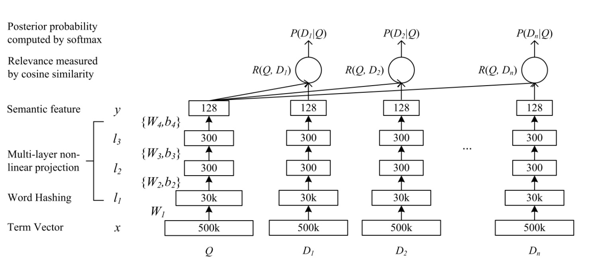
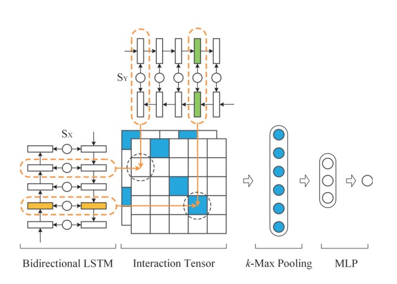
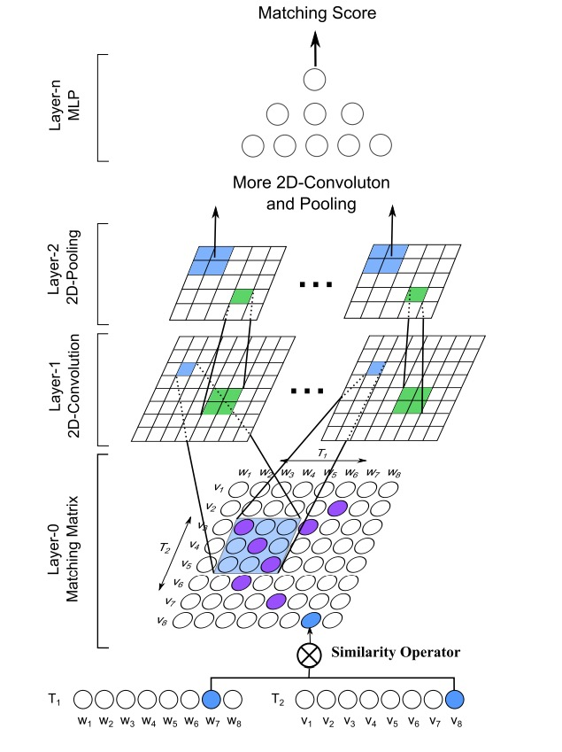

# 06.21-06.27 回顾

## 1. 深度文本匹配

### 1.1 应用场景

- 搜索场景（Query and results）
- 智能客服 （Q&Q, Q&A）
- 机器翻译
- 推荐（今日头条）

### 1.2 单语义文本匹配

- 基本框架

  

- 一个baseline，效果不错

  

- DSSM （Deep Structured Semantic Models）

  - [Huang P S , He X , Gao J , et al. Learning deep structured semantic models for web search using clickthrough data[C]// Proceedings of the 22nd ACM international conference on Conference on information & knowledge management. ACM, 2013.](https://www.microsoft.com/en-us/research/wp-content/uploads/2016/02/cikm2013_DSSM_fullversion.pdf)  
  - 

  - Loss Function
    $$
    P(d \mid q) =\frac{\exp (\gamma f(q, d))}{\sum_{d^{\prime} \in D} \exp \left(\gamma f\left(q, d^{\prime}\right)\right)}
    $$

    $$
    L(\Lambda) =-\log \prod_{(q, d^{+})} P\left(d^{+} \mid q\right)
    $$

    其中，$\gamma$ 是 Softmax 函数的平滑参数 $; f(q, d)$ 表示一个查询项 $q$ 与文档 $d$ 之间的匹配度。$D$ 表示所有文档的集合。实际应用中，一般采用若干正例 $d^{+}$ 以及采样若干负例 $d^{-}$, 来取代整个集合 $D$ 。可以看到word2vec的影子。

- CDSSM（Convolutional Deep Structured Semantic Models ）

  - 类似DSSM，但是加入了卷积层

- ARC-I

  - [Hu B , Lu Z , Li H , et al. Convolutional Neural Network Architectures for Matching Natural Language Sentences[J]. 2015.](http://www.hangli-hl.com/uploads/3/1/6/8/3168008/hu-etal-nips2014.pdf) 
  - 

  - Loss function

    given the following triples $(\mathbf{x}, \mathbf{y}^{+}, \mathbf{y}^{-})$ from the oracle, with $\mathbf x$ matched with $\mathbf{y}^{+}$ better than with $\mathbf{y}^{-}$. 
    $$
    e\left(\mathbf{x}, \mathbf{y}^{+}, \mathbf{y}^{-} ; \Theta\right)=\max \left(0,1+\mathbf{s}\left(\mathbf{x}, \mathbf{y}^{-}\right)-\mathbf{s}\left(\mathbf{x}, \mathbf{y}^{+}\right)\right)
    $$
    where $\mathbf s(\mathbf{x}, \mathbf{y})$ is predicted matching score for $(\mathbf{x}, \mathbf{y})$ , 

### 1.3 多语义文本匹配

- 基本框架 

  

- MV-LSTM 

  - A Deep Architecture for Semantic Matching with Multiple Positional Sentence Representations 

    

- MatchPyramid 

  - Pang L , Lan Y , Guo J , et al. Text Matching as Image Recognition[J]. 2016. 

    

### 1.4 参考资料

- [深度文本匹配总结](https://blog.csdn.net/melon0014/article/details/82466595) 

  

## 2. Attention

### 2.1 Attention for Image Caption 


### 2.2 Attention for Machine Translation  


### 2.3 Self-Attention


## 3. Transformer

- RNN/LSTM-based models
  - lack of long-term dependency 
  - linear computation
  - shallow model (deep from time perspective) 

- Transformer的几个关键问题

  1. 如何实现long-term dependency 

     每两个word之间都会计算attention，从而可以捕获long-term dependency。

  2. self-attention, encoder-decoder attention, decoder attention 都有哪些区别？

     self-attention和decoder attention都是self-attention。分别是：

     ```python
     MultiHeadAttention(enc_inputs, enc_inputs, enc_inputs, enc_self_attn_mask)
     MultiHeadAttention(dec_inputs, dec_inputs, dec_inputs, dec_self_attn_mask)
     ```

     encoder-decoder attention 是类似于seq2seq的attention

     ```python
     MultiHeadAttention(dec_outputs, enc_outputs, enc_outputs, dec_enc_attn_mask)
     ```

  3. 如何编码词的顺序

     position embedding

- transformer的代码实现
  - [pytorch implementation](src/transformer.py) 


## 4. BERT

- Pretraining
  - word2vec ( skip-gram, Glove )	
  - Contextualized representation 
    - Language Modeling : LSTM + Unsupervised data (适合NLG，对于embedding而言，只有上文信息，缺少了下文的信息)
    - Bidriectional Language Modeling : EMLo ( 其实是双向的LM的拼接，还不是真正的同时理解上下文 ) 
    - Masked Language Modeling 
      - 其实是在输入中加入了噪声，然后要求模型去掉噪声，还原出输入。类比dropout，denosing encoder。
      - BERT使用transfomer encoder去预测mask，也可以使用别的模型，如LSTM 

- bert的代码实现
  - [pytorch implementation](src/bert.py) 

## 5. 主题模型

### PGM概率图模型

- Model
  - LDA（2003）（Blei）
  - MMSB（2008）（Blei）
  - Bayesian Neural Networks （Neil）
- Inference（Approximate）
  - MCMC（Markov chain Monte Carlo ）
  - Variational Inference（变分法）（Micheal Jordan, Blei）
- Non parametric Bayesian
  - LDA, k-means
  - Stochastic Process
    - Dirichlet Process 
    - Chinese Restaurant Process
    - Indian Buffet Processs
    - Stick-breaking Process
    - Gaussian Process


# Plan of next week

- 


