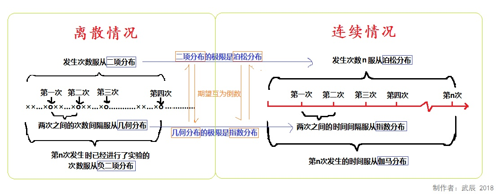
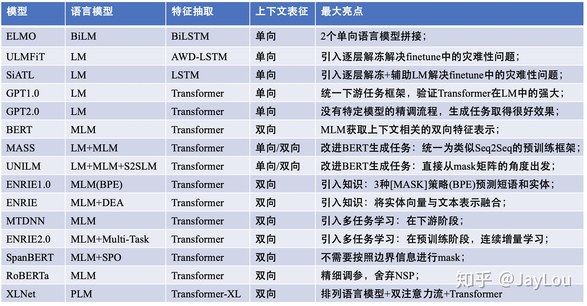

# 10.18-10.24 回顾

## BERT 补充

- Transformers Decode 侧的特点

  - self-attention的时候要加mask
  - encoder-decoder-attention 的时候，Q来自decoder，K、V来自encoder

- BERT中，position embedding都是随机生成的，需要注意的是在Transformer论文中的position embedding由sin/cos函数生成的固定的值，而在这里代码实现中是跟普通word embedding一样随机生成的，可以训练的。作者这里这样选择的原因可能是BERT训练的数据比Transformer那篇大很多，完全可以让模型自己去学习。

- BERT的MLM属于Denosing Autoencoder的思路

- BERT的损失函数：

  - 由两部分组成，第一部分是来自 Mask-LM 的单词级别分类任务，另一部分是句子级别的分类任务。
    $$
    L\left(\theta, \theta_{1}, \theta_{2}\right)=L_{1}\left(\theta, \theta_{1}\right)+L_{2}\left(\theta, \theta_{2}\right)
    $$
    其中  $\theta$  是 BERT 中 Encoder 部分的参数,  $\theta_{1}$  是 Mask-LM 任务中在 Encoder 上所接的输出层中的参数，  $\theta_{2}$  则是句子预测任务中在 Encoder 接上的分类器参数。因此，在第一部分的损失函数 中，如果被 mask 的词集合为 M，因为它是一个词典大小 |V| 上的多分类问题，那么具体说来有：
    $$
    L_{1}\left(\theta, \theta_{1}\right)=-\sum_{i=1}^{M} \log p\left(m=m_{i} \mid \theta, \theta_{1}\right), m_{i} \in[1,2, \ldots,|V|] 
    $$
    在句子预测任务中，也是一个分类问题的损失函数：
    $$
    L_{2}\left(\theta, \theta_{2}\right)=-\sum_{j=1}^{N} \log p\left(n=n_{i} \mid \theta, \theta_{2}\right), n_{i} \in[  IsNext, NotNext  ]
    $$
    因此，两个任务联合学习的损失函数是：
    $$
    L\left(\theta, \theta_{1}, \theta_{2}\right)=-\sum_{i=1}^{M} \log p\left(m=m_{i} \mid \theta, \theta_{1}\right)-\sum_{j=1}^{N} \log p\left(n=n_{i} \mid \theta, \theta_{2}\right) 
    $$
    具体的预训练工程实现细节方面，BERT 还利用了一系列策略，使得模型更易于训练，比如对于学 习率的 warm-up 策略，使用的激活函数不再是普通的 ReLu，而是 GeLu，也使用了dropout 等常见的训练技巧。

- 各种激活函数介绍：

  - 从ReLU到GELU，一文概览神经网络的激活函数 - 机器之心的文章 - 知乎 https://zhuanlan.zhihu.com/p/98863801

  - gelu图像

    

- 标签平滑
  $$
  y_{k}^{L S}=y_{k}(1-\alpha)+\alpha / K
  $$

  - 可以更好的泛化，不只是关注正确类别的概率
  - label smoothing(标签平滑)学习笔记 - Celine的文章 - 知乎 https://zhuanlan.zhihu.com/p/116466239
  - 标签平滑&深度学习：Google Brain解释了为什么标签平滑有用以及什么时候使用它 - AI算法与图像处理的文章 - 知乎 https://zhuanlan.zhihu.com/p/101553787

- Byte Pair Encoding

  - BPE最早是一种压缩算法，基本思路是把经常出现的byte pair用一个新的byte来代替，例如假设('A', ’B‘）经常顺序出现，则用一个新的标志'AB'来代替它们。
  - 一分钟搞懂的算法之BPE算法 - zenRRan的文章 - 知乎 https://zhuanlan.zhihu.com/p/38130825
  - CS224N笔记(十二):Subword模型 - 川陀学者的文章 - 知乎 https://zhuanlan.zhihu.com/p/69414965

- 一张图说明二项分布、泊松分布、指数分布、几何分布、负二项分布、伽玛分布的联系

  

## BERT的各种变种

### 1. ERNIE（百度）

- 引入了三种mask的方式，分别对token，entity，phrase进行mask。
- 引入了对话语料，丰富语料的来源，并针对对话语料，给出了一个和NSP相似的任务：DLM（Dialogue Language Model）。
- 很多任务上较bert都有1-2%的提升，并且作者做了实验表明DLM任务在NLI任务上有提升。
- 论文：ERNIE: Enhanced Representation through Knowledge Integration
- GitHub：https://github.com/PaddlePaddle/ERNIE

### 2. ERNIE 2.0（百度）

- 在之前的模型上做了新的改进，这篇论文主要是走 **多任务 **的思想，引入了多大7个任务来预训练模型，并且采用的是逐次增加任务的方式来预训练。
- 引入了Task Embedding，来区别不同的任务，训练的方法是先训练任务1，保存模型，然后加载刚保存的模型，再同时训练任务1和任务2，依次类推，到最后同时训练7个任务。
- 较ERNIE1.0版本基本上全面提升，并且在阅读理解的任务上有很大的提升。

- 论文：ERNIE 2.0: A CONTINUAL PRE-TRAINING FRAMEWORK FORLANGUAGE UNDERSTANDING
- GitHub：https://github.com/PaddlePaddle/ERNIE

### 3. BERT-wwm

- BERT-wwm是哈工大开源出来的，在原始bert-base的基础上引入whole word mask，其实就是分词后的词进行mask。
- 因为是在bert-base的基础上训练的，因此无缝对接现在的bert的使用方法，直接替换预训练模型即可，都不需要更改任何文件。而且在很多中文任务上较bert都有一些提升，因此推荐使用。

- 论文：Pre-Training with Whole Word Maskingfor Chinese BERT
- GitHub：https://github.com/ymcui/Chinese-BERT-wwm

### 4. SpanBERT

- 首先从一个几何分布中采样span的长度，且限制最大长度为10，然后再随机采样（如均匀分布) span的初始位置。

- SBO（Span Boundary Objective）：通过span的边界处的两个token来预测span中mask的词
  $$
  \begin{aligned}
  \mathbf{h} &=\text { LayerNorm }\left(\operatorname{GeLU}\left(W_{1} \cdot\left[\mathbf{x}_{s-1} ; \mathbf{x}_{e+1} ; \mathbf{p}_{i}\right]\right)\right) \\
  f(\cdot) &=\text { LayerNorm }\left(\operatorname{GeLU}\left(W_{2} \cdot \mathbf{h}\right)\right)
  \end{aligned}
  $$

-  NSP 没有用，这里，SpanBERT 作者们给出了下面两个解释：

  1. 相比起两句拼接，一句长句，**模型可以获得更长上下文**（类似 XLNet 的一部分效果）；
  2. 在 NSP 的负例情况下，基于另一个文档的句子来预测词，会**给 MLM 任务带来很大噪音**。

  于是 SpanBERT 就没采用 NSP 任务，**直接一句长句，然后 MLM 加上 SBO 任务来进行预训练**。

- 主要训练细节：

  1. 训练时用了 **Dynamic Masking** 而不是像 BERT 在预处理时做 Mask；
  2. 取消 BERT 中随机采样短句的策略
  3. 还有对 Adam 优化器中一些参数改变。

- SpanBERT在抽取式QA上的效果表现优异，在抽取式QA上是值得尝试的。

- 论文：SpanBERT: Improving Pre-training by Representing and Predicting Spans
- GitHub：https://github.com/facebookresearch/SpanBERT
- SpanBert：对 Bert 预训练的一次深度探索 - Andy Yang的文章 - 知乎 https://zhuanlan.zhihu.com/p/75893972

### 5. RoBERTa

- 主要有以下六处改变的地方：
  1. Adam算法中的参数调整，$\epsilon$ 由1e-6改成1e-8，$\beta_2$ 由0.999改成0.98。
  2. 使用了更多的数据，从16GB增加到160GB。
  3. 动态mask取代静态mask。(在bert中是在数据预处理时做不同的mask 10次，这样在epochs为40的时候，平均每条mask的序列会出现4次，作者在这里使用动态mask，即每次epochs时做一次不同的mask。)
  4. 去除NSP任务，并采用full-length 序列。
  5. 更大的batch size，更多的训练步数。
  6. 用byte-level BPE取代character-level BPE。

- 论文：RoBERTa: A Robustly Optimized BERT Pretraining Approach
- GittHub：https://github.com/brightmart/roberta_zh 

### 6. DistillBert

- 蒸馏方法：
  1. 给定原始的bert-base作为teacher网络。
  2. 在bert-base的基础上将网络层数减半（也就是从原来的12层减少到6层）
  3. 利用teacher的软标签和teacher的隐层参数来训练student网络。
- 损失函数
  1. $L_{ce}$。teacher网络softmax层输出的概率分布和student网络softmax层输出的概率分布的交叉熵（注：MLM任务的输出）。
  2. $L_{mlm}$。student网络softmax层输出的概率分布和真实的one-hot标签的交叉熵。
  3. $L_{cos}$。student网络隐层输出和teacher网络隐层输出的余弦相似度值。
- 模型大小减小了40%（66M），推断速度提升了60%，但性能只降低了约3%。

- 论文：DistilBERT, a distilled version of BERT: smaller, faster, cheaper and lighter

### 7. ALBERT

- Factorized embedding parameterization 
- Cross-layer parameter sharing 
- Inter-sentence coherence loss（SOP（句子顺序预测））

- 论文：ALBERT: A LITE BERT FOR SELF-SUPERVISEDLEARNING OF LANGUAGE REPRESENTATIONS
- GitHub：https://github.com/brightmart/albert_zh

### 8. TinyBERT

- 更多的蒸馏

### 9. ELECTRA

- 生成式的Masked language model (MLM) 预训练任务改成了判别式的Replaced token detection (RTD) 任务。

  

- 随机替换太简单了，使用一个MLM的G-BERT来对输入句子进行更改，然后丢给D-BERT去判断哪个字被改过。目标函数：
  $$
  \min _{\theta_{G}, \theta_{D}} \sum_{x \in \mathcal{X}} \mathcal{L}_{M L M}\left(x, \theta_{G}\right)+\lambda \mathcal{L}_{D i s c}\left(x, \theta_{D}\right)
  $$

- 在优化判别器时计算了所有token上的loss，而以往计算BERT的MLM loss时会忽略没被mask的token。作者在后来的实验中也验证了在所有token上进行loss计算会提升效率和效果。

- 作者只共享了embedding层参数。

- 当生成器大小为判别器的1/4-1/2时，模型性能最好。

- 同等大小的大模型上，性能也和当前最佳roberta性能相当，但是训练计算量只有roberta的1/4。

- 如何评价NLP算法ELECTRA的表现？ - 香侬科技的回答 - 知乎 https://www.zhihu.com/question/354070608/answer/885907890

  

- 论文：ELECTRA: PRE-TRAINING TEXT ENCODERS AS DISCRIMINATORS RATHER THAN GENERATORS
- GitHub：https://github.com/ymcui/Chinese-ELECTRA

### 10. XLNet

- 相比于BERT，XLNet的三点改变：
  - BERT是DAE模型（Denoising AutoEncoder），而XLNet是自回归模型（Autoregressive LM）。具体而言，引入了Permutation Language Model的训练目标，通过Attention Mask，把其它没有被选到的单词Mask掉，不让它们在预测单词Ti的时候发生作用。具体实现的时候，XLNet是用“双流自注意力模型”实现的。
  -  引入了Transformer-XL的主要思路：相对位置编码以及分段RNN机制。
  - 加大增加了预训练阶段使用的数据规模。

- 对比图

### 参考资料

- NLP中的预训练语言模型（一）—— ERNIE们和BERT-wwm https://www.cnblogs.com/jiangxinyang/p/11512596.html
- NLP中的预训练语言模型（二）—— Facebook的SpanBERT和RoBERTa https://www.cnblogs.com/jiangxinyang/p/11528215.html

- NLP中的预训练语言模型（三）—— XL-Net和Transformer-XL https://www.cnblogs.com/jiangxinyang/p/11534492.html
- NLP中的预训练语言模型（四）—— 小型化bert（DistillBert, ALBERT, TINYBERT）https://www.cnblogs.com/jiangxinyang/p/11715678.html
- NLP中的预训练语言模型（五）—— ELECTRA https://www.cnblogs.com/jiangxinyang/p/11813054.html 

## 轮子

- Transformer
  - https://github.com/huggingface/transformers
- transformer is all you need 代码实现
  https://nlp.seas.harvard.edu/2018/04/03/attention.html

- 基于Transformers的文本分类
  - 基于最新的 [huggingface](https://github.com/huggingface) 出品的 [transformers](https://github.com/huggingface/transformers/releases/tag/v2.2.2) v2.2.2代码进行重构。为了保证代码日后可以直接复现而不出现兼容性问题，这里将 [transformers](https://github.com/huggingface/transformers/releases/tag/v2.2.2) 放在本地进行调用。
  - github地址：https://github.com/zhanlaoban/Transformers_for_Text_Classification
  - 预训练模型下载：https://github.com/zhanlaoban/NLP_PEMDC

- Keras-Bert-Ner
  - https://github.com/liushaoweihua/keras-bert-ner

- keras-bert
  - https://github.com/CyberZHG/keras-bert
  - https://github.com/bojone/bert_in_keras（使用上面库的一些模版）
- bert4keras
  - 在加载官方预训练权重的基础上，可以对bert的内部结构进行修改。在keras-bert的基础上改进。
  - 当Bert遇上Keras：这可能是Bert最简单的打开姿势 https://kexue.fm/archives/6736
  - 自己实现了一个bert4keras： https://kexue.fm/archives/6915
  - GitHub：https://github.com/bojone/bert4keras

- 多种中文预训练模型的下载
  - https://github.com/ymcui

## 资料

- 资料：transformer相关

  - The Illustrated Transformer 博客原文
    https://jalammar.github.io/illustrated-transformer/

    BERT大火却不懂Transformer？读这一篇就够了
    https://zhuanlan.zhihu.com/p/54356280

    使用Excel通俗易懂理解Transformer！
    https://www.jianshu.com/p/2b0a5541a17c

- 资料：BERT相关

  - 从Word Embedding到Bert模型—自然语言处理中的预训练技术发展史
    https://zhuanlan.zhihu.com/p/49271699

    NLP的游戏规则从此改写？从word2vec, ELMo到BERT
    https://zhuanlan.zhihu.com/p/47488095

- 资料：各种BERT和新模型可直接使用的轮子组件模板
  - huggingface的transformer组件
    https://github.com/huggingface/transformers

- 信息抽取：
  - 基于DGCNN和概率图的轻量级信息抽取模型
    https://kexue.fm/archives/6671
  - 用bert4keras做三元组抽取
    https://kexue.fm/archives/7161

## 备忘

- 如何理解LSTM后面的CRF
  - https://www.zhihu.com/question/62399257/answer/441444410
  - https://www.zhihu.com/question/62399257/answer/206903718
  - MEMM和CRF有什么不同？ - 慢慢小乌龟的回答 - 知乎 https://www.zhihu.com/question/30869789/answer/441430500

# Plan of next week

- 

